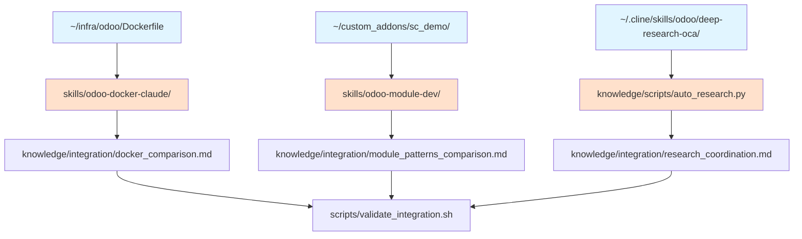

# Integration Points - Odoo Expertise Infrastructure

**Purpose**: Cross-reference map to prevent duplication and ensure compatibility with existing infrastructure

**Last Updated**: 2025-11-01

---

## Architecture Overview

```
┌─────────────────────────────────────────────────────────────────┐
│                    Existing Infrastructure                       │
│  ~/infra/odoo/          ~/custom_addons/sc_demo/                │
│  ~/.cline/skills/odoo/deep-research-oca/                        │
└─────────────────────────────────────────────────────────────────┘
                              ↓ Integration
┌─────────────────────────────────────────────────────────────────┐
│                  New Sprint3 Infrastructure                      │
│  skills/                   knowledge/         scripts/           │
│  - odoo-docker-claude      - integration/    - validate_*.sh    │
│  - odoo-module-dev         - scripts/                           │
│  - odoo-sh-devops          - playbooks/                         │
│  - odoo-studio-ops                                              │
└─────────────────────────────────────────────────────────────────┘
```

---

## Cross-Reference Map

### 1. Docker Infrastructure Integration

**Existing**: `~/infra/odoo/`
- **Dockerfile** (939 bytes) - Python 3.11-slim, Odoo 16.0, basic setup
- **docker-compose.yml** (547 bytes) - Odoo + PostgreSQL orchestration
- **odoo.conf** (184 bytes) - Basic runtime configuration
- **requirements.txt** (274 bytes) - Python dependencies + anthropic==0.36.0

**New**: `skills/odoo-docker-claude/`
- **Enhancement Focus**: Multi-stage builds, supply chain security, non-root patterns
- **Relationship**: Extends existing with production-grade enhancements
- **Migration Path**: See `knowledge/integration/docker_comparison.md`

**Integration Strategy**:
- ✅ **Reference existing** as baseline implementation
- ✅ **Document enhancements** separately (multi-stage, security hardening)
- ✅ **Provide migration guide** from simple to production-ready
- ❌ **DO NOT duplicate** - cross-reference instead

---

### 2. Sample Module Integration

**Existing**: `~/custom_addons/sc_demo/`
- **Structure**: Minimal OCA-compliant module
- **Version**: Odoo 16.0.1.0.0
- **Components**: `__manifest__.py`, `models/`, `security/`, `data/`
- **Purpose**: Reference implementation for module structure

**New**: `skills/odoo-module-dev/`
- **Enhancement Focus**: Full OCA patterns, testing, migrations, CI/CD
- **Relationship**: Uses sc_demo as starting template, extends with advanced patterns
- **Pattern Differences**: See `knowledge/integration/module_patterns_comparison.md`

**Integration Strategy**:
- ✅ **Use sc_demo** as reference implementation in skill docs
- ✅ **Document extensions** (tests, migrations, pre-commit hooks)
- ✅ **Preserve simplicity** of sc_demo for quick scaffolding
- ❌ **DO NOT replace** - new patterns complement existing

---

### 3. Deep Research Skill Integration

**Existing**: `~/.cline/skills/odoo/deep-research-oca/SKILL.md`
- **Purpose**: Auto-crawl OCA, Reddit r/odoo, Odoo forums
- **Sources**: GitHub OCA, Reddit, Forums, Official Docs
- **Output**: Research summaries, code patterns, community solutions
- **Cache**: `~/.cline/research/*.md`

**New**: `knowledge/scripts/auto_research.py`
- **Enhancement Focus**: Quality scoring, citation formatting, automated daily notes
- **Relationship**: Implements existing skill spec with structured output
- **Coordination**: See `knowledge/integration/research_coordination.md`

**Integration Strategy**:
- ✅ **Coordinate query sets** (complementary, not duplicative)
- ✅ **Shared citation format** validation
- ✅ **Reference existing skill** in auto_research.py docs
- ❌ **DO NOT duplicate** research queries or sources

---

## Shared Resource Coordination

### A. Docker Base Images

**Coordination**:
- Existing uses `python:3.11-slim` directly
- New adds multi-stage builds with build/runtime separation
- **Shared**: Base image version (python:3.11-slim)
- **Enhanced**: Security (SHA256 pinning), non-root user, vulnerability scanning

**Decision Rule**: Use simple Dockerfile for local dev, enhanced for production

---

### B. OCA Module Patterns

**Coordination**:
- `sc_demo/` provides minimal working example
- `odoo-module-dev` skill provides full OCA compliance
- **Shared**: `__manifest__.py` structure, `security/ir.model.access.csv` format
- **Enhanced**: Tests, migrations, pre-commit hooks, README generation

**Decision Rule**: Start with sc_demo structure, apply odoo-module-dev patterns for production modules

---

### C. Research Sources

**Coordination**:
- Deep-research-oca skill defines sources and workflow
- auto_research.py implements automation with quality scoring
- **Shared**: OCA GitHub repos, Reddit r/odoo, Stack Overflow, Odoo forums
- **Enhanced**: Quality scoring algorithm, citation template, daily note automation

**Decision Rule**: Use auto_research.py for daily automation, reference deep-research-oca for manual deep-dives

---

## Dependency Graph



**Legend**:
- Blue: Existing infrastructure (read-only references)
- Orange: New infrastructure (extends existing)
- White: Integration documentation

---

## Integration Validation

**Script**: `scripts/validate_integration.sh`

**Checks**:
1. ✅ Cross-references in skill.yaml files point to valid paths
2. ✅ No duplicate Dockerfiles (enhancements documented separately)
3. ✅ sc_demo referenced (not replaced) in odoo-module-dev skill
4. ✅ Research query sets complementary (not duplicative)
5. ✅ Citation format consistent between deep-research-oca and auto_research.py

**Run**: `bash scripts/validate_integration.sh`

---

## When to Use Which

### Docker Infrastructure

| Scenario | Use |
|----------|-----|
| Local development, quick start | `~/infra/odoo/Dockerfile` |
| Production deployment, security hardening | `skills/odoo-docker-claude/` patterns |
| Learning multi-stage builds | `knowledge/integration/docker_comparison.md` |

### Module Development

| Scenario | Use |
|----------|-----|
| Quick prototype, simple module | `~/custom_addons/sc_demo/` structure |
| Production module, OCA compliance | `skills/odoo-module-dev/` full patterns |
| Understanding differences | `knowledge/integration/module_patterns_comparison.md` |

### Research Automation

| Scenario | Use |
|----------|-----|
| Daily automated research | `knowledge/scripts/auto_research.py` |
| Manual deep-dive, interactive exploration | `~/.cline/skills/odoo/deep-research-oca/` workflow |
| Understanding coordination | `knowledge/integration/research_coordination.md` |

---

## Migration Paths

### Upgrading Docker Setup

**From**: Simple `~/infra/odoo/Dockerfile`
**To**: Production-grade multi-stage build

**Steps**:
1. Review `knowledge/integration/docker_comparison.md`
2. Identify security enhancements needed
3. Apply multi-stage pattern from `skills/odoo-docker-claude/`
4. Test with `docker build` and vulnerability scanning
5. Update docker-compose.yml for new image

### Upgrading Module Structure

**From**: `sc_demo/` minimal structure
**To**: Full OCA-compliant module

**Steps**:
1. Review `knowledge/integration/module_patterns_comparison.md`
2. Add missing components (tests/, README.rst, migrations/)
3. Apply `skills/odoo-module-dev/` patterns
4. Configure pre-commit hooks
5. Run OCA validation: `pre-commit run --all-files`

---

## Maintenance Policy

**Existing Infrastructure** (`~/infra/odoo/`, `~/custom_addons/sc_demo/`, `~/.cline/skills/odoo/`):
- **Status**: Read-only references
- **Updates**: Only via their own repositories
- **Role**: Baseline implementations and reference patterns

**New Infrastructure** (`skills/`, `knowledge/`, `scripts/`):
- **Status**: Active development
- **Updates**: Sprint-based enhancements
- **Role**: Production-grade extensions and automation

**Integration Documentation** (`knowledge/integration/`):
- **Status**: Living documentation
- **Updates**: When integration points change
- **Role**: Prevent duplication, guide usage decisions

---

## Contact & Support

**Questions**: Refer to individual skill.yaml files for specific integrations
**Issues**: Use scripts/validate_integration.sh to detect integration problems
**Updates**: Review INTEGRATION_POINTS.md when infrastructure changes
